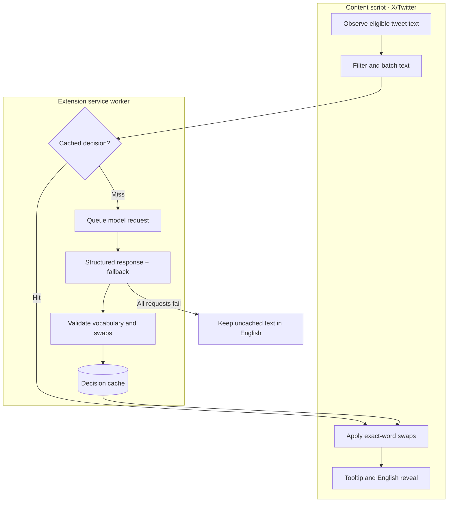

# French Weave

**Learn vocabulary during ordinary reading and coding conversations.**

Built by **Jackie Oliver**. The browser component makes small, reversible French
substitutions in English text. A separate shared-state integration lets Claude Code
and Codex use the same learning stage and vocabulary in their replies.

**Stack:** JavaScript · Chrome extensions · structured model output · Python ·
GitHub-backed learning state

## What is in this repository

This public repository is a snapshot of the original **X/Twitter extension**,
developed in September–October 2026. Its source includes model-selected exact-word
swaps, validation, caching, fallback, tooltips, and click-to-reveal English.

The newer working project adds broader website support and learning-state sync.
The **Claude Code/Codex integration is configured separately on the developer's
Mac**. Its architecture and verified behavior are documented here; its helper,
private vocabulary/event data, and newer extension source are not bundled in this
snapshot. Cloning this repository alone does not install that integration.

[Shared vocabulary and Claude Code integration →](docs/shared-state-integration.md)

## Browser inference pipeline — source included here



## Engineering choices

| Decision | Why it matters |
| --- | --- |
| Request replacement spans rather than rewritten paragraphs. | The original text remains the reference; the DOM layer can reveal English without regenerating the passage. |
| Validate model output in code. | Structured JSON makes parsing predictable, but it does not establish linguistic correctness. Vocabulary and span checks constrain what can be painted. |
| Separate content, inference, and storage. | DOM handling stays separate from provider calls; injected fetch/storage adapters make core behavior testable without Chrome. |
| Batch requests and cache decisions. | Repeated page renders can reuse decisions. Cache misses go through a serialized request queue. |
| Fall back, then leave text unchanged. | A configured fallback model gets one attempt after failure. If both fail, cached results remain usable and uncached passages stay English. |
| Keep curriculum ownership outside the language model. | In the newer shared-state system, the reducer admits words and the assistants choose where to use them. See the integration design for the distinction. |

## Read the code

- [content.js](src/content.js): observation, batching, per-tab decisions, and interaction.
- [engine.js](src/engine.js) and [gemini.js](src/gemini.js): provider requests, fallback, response parsing.
- [levels.js](src/levels.js) and [text.js](src/text.js): vocabulary checks and DOM replacement.
- [cache.js](src/cache.js): persistent decisions with an injected storage adapter.
- [Tests](test): request shape, fallback, vocabulary, prompt, and DOM behavior.

## Install this snapshot

1. Open `chrome://extensions`, enable Developer mode, and choose **Load unpacked**.
2. Select this repository folder.
3. Open the extension popup and enter your own Gemini key.
4. Open X/Twitter and use the on/off, level, model, and cache controls.

The snapshot contains specific model IDs in [gemini.js](src/gemini.js); availability
must be checked against your provider account. This documentation pass did not make
paid model requests or validate those IDs live.

## Develop and evaluate

```sh
bun install
bun test
```

On October 6, 2026, the 23 core engine, vocabulary, and prompt tests passed.
The DOM suite and live provider/browser flows were not rerun in this documentation pass.

[Model evaluations](eval/RESULTS.md) and [recorded live evaluations](eval/live/RESULTS.md)
are dated experiments, not current accuracy guarantees. The 27-tweet live input set
is not included; `eval/live/run_batches.py` expects your own local dataset.
[Requirements](REQUIREMENTS.md) and [implementation plan](PLAN.md) describe the
original snapshot; later integration behavior is scoped separately in the design note.

The public snapshot does not include the newer fixes for accent ambiguity, empty
replacements, or open-tab cache invalidation recorded in the working project's
September audit. Treat it as an engineering example, not the latest installable build.
