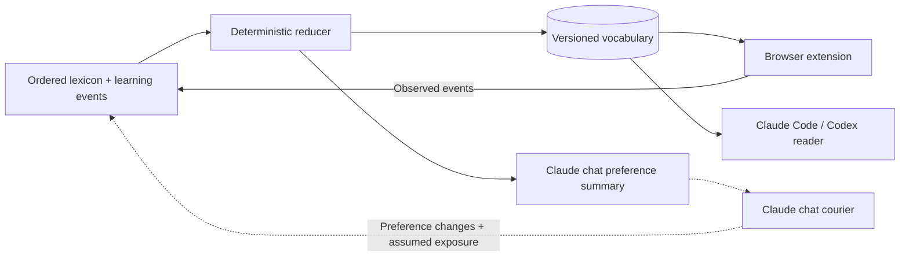

# French Weave

**A shared vocabulary system for browser reading, Claude chats, and coding assistants.**

Built by **Jackie Oliver**. French Weave adds small, reversible French substitutions
to everyday English reading. A shared learning backend tracks vocabulary, while
browser and chat prompts decide where words fit naturally.

**JavaScript · Chrome/Firefox extensions · Python · Node.js · GitHub-backed state**

This repository now includes the **0.3 browser source**, the learning reducer, a
portable copy of the Claude Code/Codex reader, and the assistant instruction template.
Personal learning records, credentials, and conversation transcripts are excluded.

## Start here

- [System architecture and learning logic](docs/shared-state-integration.md)
- [Prompts: browser, coding assistants, and Claude chat courier](docs/PROMPTS.md)
- [Browser setup and controls](docs/SETUP.md)
- [Verification and development history](docs/VERIFICATION.md)

## System overview



The reducer owns word admission and stage. Models choose contextual wording; they
do not directly promote vocabulary. The coding-assistant reader is read-only.
The separate Claude chat courier was **paused when inspected on October 6, 2026**.

## Engineering decisions

| Problem | Implementation |
| --- | --- |
| Models repeat easy, already-known words. | The prompt puts learning words first, prioritizes ones not shown today, and treats Known words as filler. The validator keeps learning words first when applying the density ceiling. |
| Model output can rewrite or damage a page. | Request exact replacement spans with context; validate vocabulary and anchors before editing plain text nodes. Restore original nodes when disabled. |
| A request can finish after the user disables a site or changes vocabulary. | A revision derived from settings, vocabulary, permissions, and cache epoch invalidates stale work before publishing decisions. |
| Retries can duplicate learning events. | Persistent queue, stable event IDs, per-device/month files, and SHA conflict retries preserve acknowledged events across interrupted uploads. |
| Prefetch is not evidence of reading. | Record `seen` when a word enters the visible viewport, and `peek` after a 700 ms gloss dwell; keep these distinct from assumed chat exposure. |
| Network loss should not erase progress. | Keep validated vocabulary and queued events locally; the Python reader retains a last-good cache and replaces it atomically. |
| Assistant context is not reliable event telemetry. | Claude Code/Codex read shared JSON only. The chat courier's preference-diff protocol is documented separately, including its limitations. |

## Read the implementation

| Component | Entry points |
| --- | --- |
| Browser orchestration | [background.js](src/background.js), [content.js](src/content.js), [page.js](src/page.js) |
| Prompt and validation | [prompt.js](src/prompt.js), [levels.js](src/levels.js), [text.js](src/text.js) |
| Model fallback and cooldown | [engine.js](src/engine.js), [gemini.js](src/gemini.js) |
| Learning uploads and credentials | [sync.js](src/sync.js), [vault.js](src/vault.js) |
| Curriculum replay | [reduce.mjs](learning/reduce.mjs), [backend protocol](learning/README.md) |
| Coding-assistant integration | [read-state.py](integrations/read-state.py), [instruction template](integrations/assistant-instructions.md) |

## Verify locally

```sh
bun install --frozen-lockfile
bun test
python3 integrations/test-read-state.py
node learning/test-reducer.mjs
bun run build:firefox
```

The checks use mocks and synthetic fixtures; they do not modify a real learning
repository or send text to a model. The browser code points to the original private
data repository by default. See setup for configuring a repository you control.

## Scope and evidence

The October 6 publication passed **57 browser tests / 775 assertions**, reader
cache/fallback checks, synthetic reducer replay checks, and Firefox packaging.
This is a source update, not an automatic update of an installed browser extension.
Full French clauses at Levels 3/4 remain unimplemented in the extension; it uses
Level 2 rules. Browser model IDs are configuration choices recorded in source,
not a claim of current provider availability.

An October 2 experiment reported learning-word share increasing from **23% to 42%**
over 54 passages after prompt changes. This was a small historical evaluation with
model/fallback variation, not a controlled learning-outcome study or current benchmark.
See [evidence and limits](docs/VERIFICATION.md).
