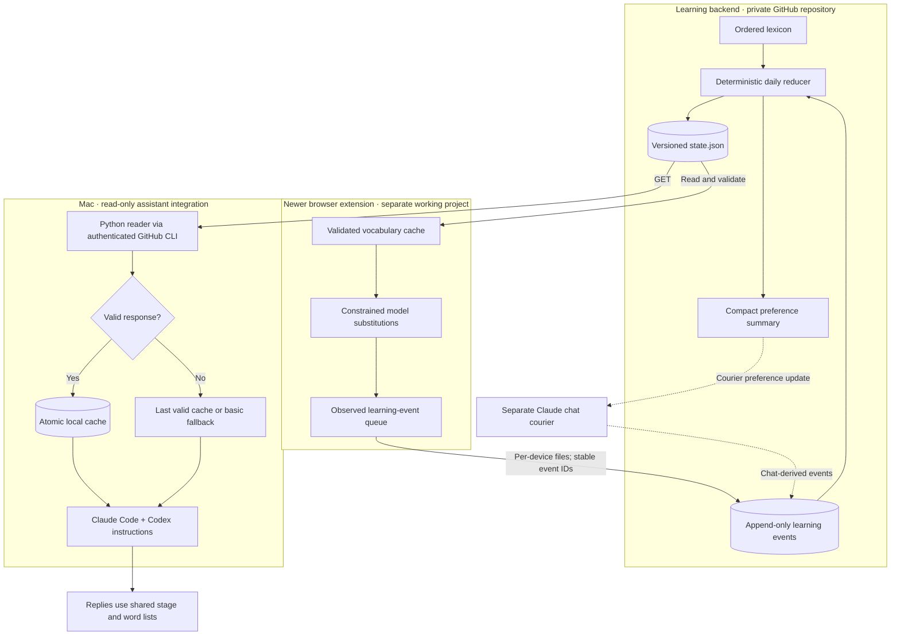

# Shared vocabulary across browser and coding assistants

This describes the implemented working system reviewed on **October 6, 2026**.
It combines the September 22 implementation conversation with the current local
reader, assistant instructions, extension sync module, and reducer. The public
extension snapshot in this repository predates this integration.

## System boundaries

Solid arrows describe the implemented browser/reader data paths. Dashed arrows
show the separate Claude chat courier contract; its current scheduling was not
verified in this documentation pass. **Claude chat and Claude Code are different
integration paths.** Claude Code and Codex do not send events through the reader.

## Claude Code and Codex: how the read works

The installed integration has one Python helper, `read-state.py`, referenced by
both the user's Claude Code `CLAUDE.md` and Codex `AGENTS.md` instructions.

1. At the first non-urgent response, the instructions ask the assistant to run the
   helper. They request another read after 15 minutes during continued use.
2. The helper returns a valid local cache younger than 15 minutes. Otherwise it
   reads `state.json` from the configured private GitHub repository using an
   existing authenticated GitHub CLI session, with a 15-second subprocess timeout.
3. It validates the stage, version, word count, status values, required text fields,
   control characters, and duplicate French entries before accepting the response.
4. It writes a temporary file and atomically replaces the cache. A failed refresh
   preserves the last valid state. With no valid state, the helper exits unsuccessfully
   and the instructions select a small Stage 1 fallback vocabulary.
5. The assistant treats the JSON as vocabulary data, not as instructions. It uses
   Active words most, Shaky words often, and Known words freely, following the
   shared stage and the user's readability rules.

This is an **instruction-driven reader**, not a Claude Code hook, MCP server,
background scheduler, or hard enforcement layer. Refresh frequency and French
density depend on the assistant following its instructions. New Claude Code
sessions were required to pick up the original instruction change.

The reader performs GET requests and local cache writes only. It does not upload
chat text, record exposures, change word status, or modify the remote curriculum.
The user's complete vocabulary JSON stays private; no personal event records or
credentials are included here.

## Why this architecture

| Choice | Engineering rationale |
| --- | --- |
| One reducer owns curriculum state. | Browser and assistant clients consume the same version, avoiding independent word-admission rules that drift across applications. |
| Read-only assistant integration first. | The implementation conversation explicitly scoped this to sharing a word list. Reliable feedback requires its own event protocol; prose instructions cannot guarantee exposure accounting. |
| Full JSON for coding assistants. | Active, Shaky, and Known remain explicit. The separate compact preference line summarizes Known above 150 words; the JSON reader avoids that truncation. |
| Validate before replacing cached state. | A malformed remote file or network outage should not erase a usable vocabulary. Atomic replacement avoids leaving partially written cache JSON. |
| Separate observed from assumed exposure. | Browser viewport events and presumed chat exposure are different evidence. They should not be silently treated as measured recall. |
| Separate event writers and retry IDs. | The newer browser writes device/month files, checks remote file SHAs, retries conflicts, and deduplicates stable event IDs on upload. This limits duplicate writes after a lost response. |

## Who controls learning pace

The ordered lexicon supplies candidate words. The reducer admits at most **five
new words per day**, fills an Active pool of **20**, and pauses refills when **five
or more words are Shaky**. These are admission limits, not a guarantee of five new
words encountered every day. Models choose where eligible words fit in prose.

As inspected, Active-to-Known promotion requires three weighted exposure days
and a clean recent exposure streak. From October 2, it also requires at least one
observed browser exposure day; assumed chat exposure alone no longer suffices.
Correct self-use can promote a word directly. Asking for a meaning or revealing
English makes it Shaky; peek events also affect promotion/recovery. Shaky words
can recover after seven quiet days, so **Known remains a heuristic, not a recall-test
result**. The coding-assistant reader cannot itself advance these statuses.

## Evidence and limits

- The September 22 chat records the requested read-only scope, deployment to both
  instruction files, and successful cache/offline/invalid-data checks at that time.
- The October 6 inspection confirmed the installed reader's validation, timeout,
  cache, and fallback logic, plus both instruction-file references. A live read
  returned a valid stage and vocabulary. No chat contents are reproduced here.
- The newer extension's source implements state download, queued event upload,
  conflict retries, and per-device files. Its recorded September browser checks and
  October evaluation are historical evidence, not a fresh end-to-end run here.
- No claim is made here that a scheduled courier is currently running, both machines
  converge live, every assistant obeys the refresh instructions, or language mastery
  has been measured. The public extension source remains the older X-only snapshot.
