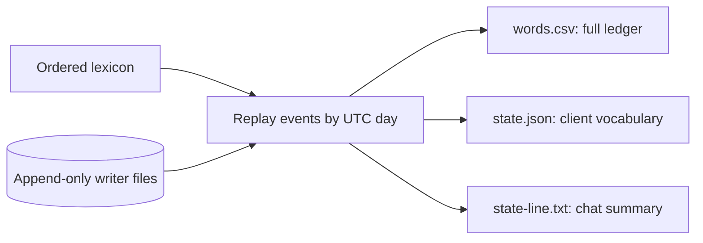
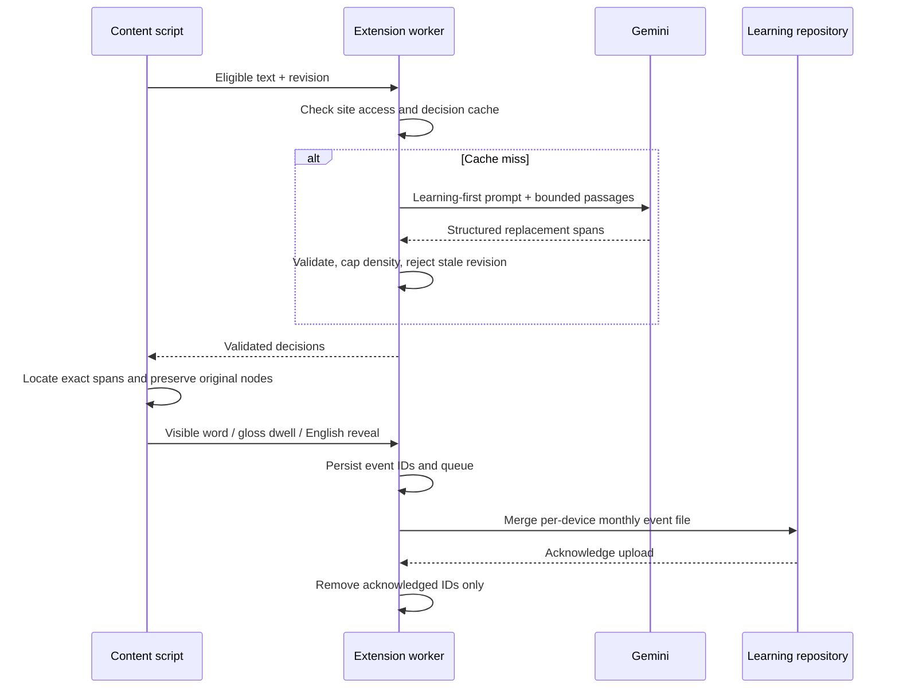

# Architecture and learning logic

The system has four paths: a deterministic curriculum backend, a browser client,
a read-only coding-assistant client, and a separate Claude chat courier. Source
and instruction templates are included; private learner records and chats are not.

## 1. Curriculum state

[reduce.mjs](../learning/reduce.mjs) rebuilds outputs from the lexicon and events.
The JSON contains a content-derived version, stage, and Active/Shaky/Known words.
Queue words stay in the full ledger until admitted. Clients share the same JSON
rather than independently deciding what enters the curriculum.

| Rule | Current implementation |
| --- | --- |
| Admission | Fill 20 Active slots in lexicon order, at most five new words per day. At least five Shaky words pause refills. Seed events bypass the admission cap. |
| Exposure | A day with `seen` counts one; a day with only `assumed` also counts one. Repeated same-day exposure does not multiply the daily weight. |
| Active → Known | Three weighted exposure days, a clean recent exposure streak, and (from October 2, 2026) at least one observed `seen` day. Correct self-use (`typed`) promotes directly. |
| Shaky | `flip` or `asked` makes a word Shaky. Two `peek` days within the reducer's seven-day window can make a Known word Shaky; a peek blocks recent Active graduation and restarts Shaky recovery. |
| Recovery | Seven quiet days without another negative signal, or `typed`, can restore Known. This is a heuristic, not a recall test. |
| Stage | Stage 2 at 40 Known, Stage 3 at 150, Stage 4 at 400; a configured override can pin it. |

The daily admission cap does not imply five new words encountered every day.
Encounter rate depends on available Active slots, content, model choices, and use.
Stage changes do not imply the browser has implemented every stage's presentation.

## 2. Browser request and feedback path

Site exceptions override the new-site default; the global off switch wins over both.
Browser host permission is still required. Text handling excludes editors, controls,
code, hidden/non-English blocks, and recognized sensitive contexts. The model is
also instructed to avoid unsafe substitutions; keyword filtering is not a complete
semantic classifier. Enabled reading passages go to the configured model provider.
Learning events contain word/event metadata, not page text or URLs.

Requests contain at most eight passages of 2,000 characters each. The worker
serializes model calls, falls back after failure, and honors cooldowns for rate
limits, overload, and timeouts. Content retries failed passages with a bounded
backoff. Cached results can still display when a new model call fails.

Vocabulary, settings, permissions, and a cache epoch contribute to the revision.
The worker rechecks it before storing results; the content side rejects obsolete
replies. This closes the off/cache-change race that existed in the original snapshot.

`seen` requires viewport entry while the document is visible; prefetch is not enough.
`peek` requires a 700 ms dwell for the gloss. These are deduplicated per word/day
per installation. `flip` records a reveal to English, not the return to French.
The durable queue stops accepting new events at 10,000 entries with an error.
Uploads handle lost responses by event ID and conflicting file SHAs by rereading
and merging. This does not create a transaction across browser, GitHub, and reducer.

## 3. Claude Code and Codex

[The Python reader](../integrations/read-state.py) is called by
[matching instruction sections](../integrations/assistant-instructions.md). The
instructions request a read at session start and after 15 minutes during use.
A fresh cache avoids a remote request. Otherwise the helper performs an authenticated
GitHub GET with a 15-second timeout, validates the JSON, and atomically replaces its
local cache. A failure keeps the last valid state; no valid state produces an error
and the instructions fall back to a small basic vocabulary.

This is instruction-driven, not an MCP server, hook, or background service.
Prompt compliance controls refresh and reply density. Neither assistant writes
learning events through this reader. The published copy changes only the interpreter
and GitHub executable paths for portability; configure its endpoint for your own data.

## 4. Claude chats and the courier

Claude chats use a saved preference state line and separate language instructions.
The inspected courier does **not** scan conversation transcripts. It compares the
preference line with `last-synced-line.txt`: newly Known words imply `typed`; newly
Shaky words or changed Shaky dates imply `asked`. It adds `assumed` for Active words,
replays the reducer, commits changed files, and then replaces just the state line.
The [published courier prompt](../integrations/claude-courier-prompt.md) records this
protocol with the account name generalized.

**Observed October 6:** the cloud courier was paused, with its latest listed run
on October 4 and a configured daily 9 AM schedule. This publication did not run,
resume, or modify it. Browser uploads and read-only coding-assistant reads are
separate and do not require that courier to be enabled.

Preference changes are a lossy signal. If chats do not update the line, the courier
cannot recover the missing event; multiple changes between runs may collapse.
Its date/word/event duplicate check is not the browser's UUID upload protocol.
A Git commit followed by a preference-edit failure can leave the two out of sync;
there is no cross-service atomic commit. Above 150 Known words, the reducer's compact
line summarizes the set, while `state.json` retains every eligible word.

## Why the design evolved

The September setup discussion identified two foundational errors to avoid: counting
prefetch as exposure, and reusing cached decisions after vocabulary changes. The
September 22 implementation added shared state, retry-safe uploads, site controls,
and separate read-only assistant integration. The October review found known-word
examples dominating model choices, hover lookups missing from feedback, and
assumed-only graduation. Version 0.3 added learning-first prompts, peek events,
cooldowns/retries, and the observed-exposure requirement in the reducer.

[Prompt behavior](PROMPTS.md) distinguishes instructions from enforced checks.
[Verification](VERIFICATION.md) separates current tests from historical evidence.
